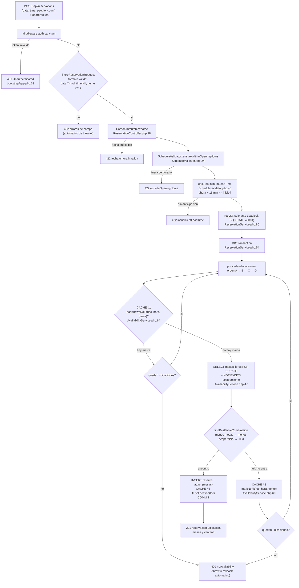

# NOTAS-2 — Mapa del request del punto c

Complemento de `NOTAS.md`: recorrido paso a paso de
`POST /api/reservations` (punto c), con archivo y línea exacta por donde pasa
la request, dónde se corta con cada error y en qué momentos interviene el
cache. Última actualización: 2026-08-24.

---

## 1. Diagrama del flujo (Mermaid)

---

## 2. El recorrido paso a paso

### Entrada

| Paso | Dónde | Qué hace |
|---|---|---|
| 0 | `public/index.php` | Kernel HTTP, middleware globales (CORS, TrimStrings...) |
| 1 | `routes/api.php:18` | Enruta a `store`, dentro del grupo `auth:sanctum` (línea 11) |
| 2 | middleware sanctum | Valida el Bearer token contra `personal_access_tokens`. Token inválido → el renderer de `bootstrap/app.php:32` responde **401 JSON**. FIN |

### Dentro del controller

`app/Http/Controllers/ReservationController.php`

| Paso | Línea | Qué hace | Salida si falla |
|---|---|---|---|
| 3 | 15 | Laravel inyecta `StoreReservationRequest`: valida formato ANTES de ejecutar el método (`date_format:Y-m-d`, `time_format:H:i`, `people_count >= 1`) | 422 automático con los errores por campo. FIN |
| 4 | 18 | `CarbonImmutable::parse(date + time)`: convierte a datetime absoluto | Fecha imposible ("2026-02-30") → ValidationException 422. FIN |
| 5 | 25 | Llama a `ReservationService::create($user, $startsAt, $gente)` | — |

### Reglas baratas (sin tocar la BD)

`app/Services/ScheduleValidator.php`

| Paso | Línea | Regla | Excepción si falla |
|---|---|---|---|
| 6 | 24 | ¿El día abre? ¿hora dentro de [open .. close − duración]? Comparación en minutos desde medianoche (evita casos borde del cierre que cruza medianoche) | `outsideOpeningHours()` → 422 |
| 7 | 40 | ¿Ahora + 15 min ≤ tu hora? | `insufficientLeadTime()` → 422 |

### Transacción con asignación automática

`app/Services/ReservationService.php`

| Paso | Línea | Qué hace |
|---|---|---|
| 8 | 86 | `retry(3, ..., when: solo SQLSTATE 40001)`: reintenta SOLO deadlocks InnoDB; cualquier otro error se propaga sin reintentar |
| 9 | 54 | Abre `DB::transaction` y recorre ubicaciones en orden A → B → C → D (orden desde `config('reservas.php')`) |
| 10 | — | **CACHE lectura**: `hasKnownNoFit(loc, hora, gente)` — ¿ya sé que acá no entran N personas? Si hay marca → saltea toda la ubicación sin consultar |
| 11 | — | `availableTables(loc, ventana)`: SELECT de mesas libres con `FOR UPDATE` (exclusión mutua anti-simultáneos) y anti-join `NOT EXISTS` para descartar superpuestas |
| 12 | — | `findBestTableCombination(mesas, gente)`: menos mesas posible → mínimo desperdicio → nunca > 3 |
| 13a | — | No encontró → **CACHE escritura**: `markNoFit(...)` y `continue` con la próxima ubicación |
| 13b | — | Encontró → `Reservation::create()` + `attach(mesas)` + **CACHE invalidación**: `flushLocation(loc)` + COMMIT → return |
| 14 | 82 | Ninguna ubicación sirvió → `ReservationException::noAvailability()`. El throw dispara ROLLBACK automático → **409** |

### Salida

`ReservationController.php:31-34` arma el **201**:
`{"message": "...", "data": {reserva + ubicacion + mesas + ventana}}`.

---

## 3. Quién responde cada error

| Momento del corte | Quién responde | Código |
|---|---|---|
| Token inválido | middleware sanctum + renderer `bootstrap/app.php:32` | 401 |
| Payload mal formado | `StoreReservationRequest` (antes del código propio) | 422 |
| Fecha imposible | controller línea 19-23 | 422 |
| Fuera de horario / sin anticipación | excepciones tipadas de `ScheduleValidator` | 422 |
| Grupo imposible de sentar | `ReservationService:82` | 409 |
| Renderizado JSON de todas las anteriores | renderer único en `bootstrap/app.php:26` | — |

Diseño: los servicios lanzan lenguaje del negocio ("no hay disponibilidad") y
un único lugar (`bootstrap/app.php`) decide el código HTTP. El controller no
tiene try/catch de negocio.

---

## 4. Los 3 momentos del cache negativo

Driver `array` de Laravel (memoria del proceso). Clave:
`no_fit:<ubicacion>.<timestamp>.<people_count>`.

1. **Lectura** (`hasKnownNoFit`, AvailabilityService.php:64): antes de
   consultar mesas de una ubicación, pregunta si ya se sabe que no hay lugar →
   se ahorra la consulta bloqueante.
2. **Escritura** (`markNoFit`, línea 69): cuando una ubicación no puede sentar
   al grupo, anota la marca para no repetir el intento.
3. **Invalidación** (`flushLocation`, línea 79): apenas se confirma una reserva,
   borra todas las marcas de esa ubicación (la realidad cambió).

Garantías de seguridad:

- La clave incluye `people_count`: "40 personas no entran en A" no dice nada
  sobre un pedido de 2.
- Sin cancelaciones, las mesas libres solo achican: una marca negativa jamás
  queda obsoleta. TTL de 60 s como cinturón extra.
- Si el cache no dice nada, SIEMPRE corre el `SELECT ... FOR UPDATE` real:
  el cache acorta camino, nunca decide.

Limitación honesta: con PHP-FPM cada request arranca con memoria vacía, así
que las marcas casi no viven; operarían bajo Octane/workers o en tests del
mismo proceso. Detalle completo en `NOTAS.md` sección 4.
